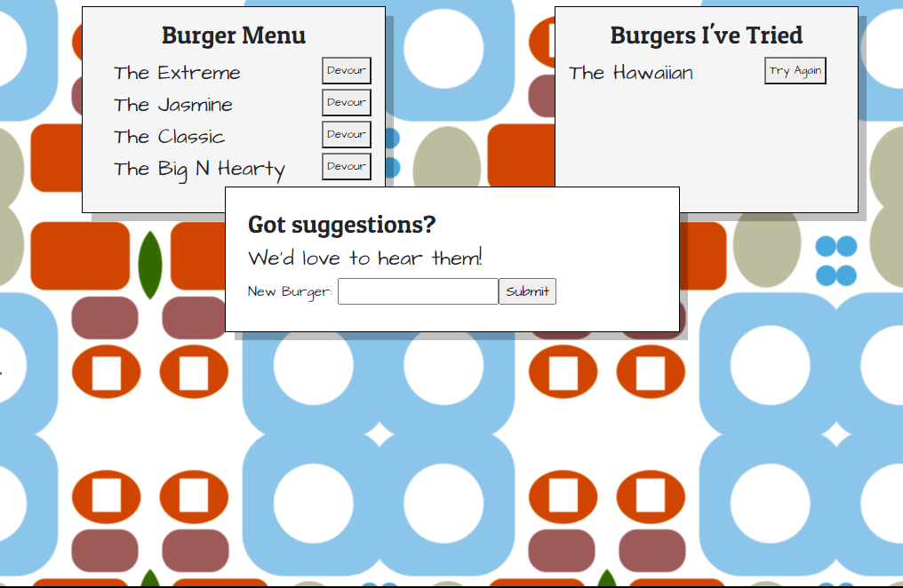

# Homework 11, Burgertime!
[](https://creativecommons.org/licenses/by/4.0/)
## Description
This is a restaurant app that lets users input the names of burgers they'd like to eat. Whenever a user submits a burger's name, your app will display the burger on the left side of the page -- waiting to be devoured.

Each burger in the waiting area also has a `Devour it!` button. When the user clicks it, the burger will move to the right side of the page, where it receives a `Try Again` button. Clicking this button moves it back to the left side of the page.

The app will store every burger in a database, whether devoured or not. As we already mentioned, there is an input form allowing the user to enter a new burger name. After sanitizing the data and making sure that it is in Title Case and does not have a definite article, the new name is added to the database, and it appears on the page in the "Undevoured" section.

It's also fully responsive, so you can eat burgers to your heart's content, even on a mobile device!
## Table of Contents
* [Description](#description)
* [Live URL](#Live%20URL)
* [Testing Instructions](#Testing%20Instructions)
* [Contribution Instructions](#How%20to%20Contribute)
* [Exciting Trivia](#Exciting%20Trivia)
* [Screenshot](#Screenshot)
* [License](#License)
* [Questions](#Questions)
## Installation Instructions
In the same directory as package.json, type ```npm install```
## Live URL
https://still-garden-84796.herokuapp.com/ 
## How to Contribute
No contributions are being accepted at this time.
## Exciting Trivia
The background graphic for this page was inspired by my TA for this course, who very kindly walked me through the logic / flow of it all this morning, when I was entirely at sea. Thank you, Paul!
## Screenshot

## License
License: CC BY 4.0
## Questions
Please contact github@sixbynine.com.
Other projects I've worked on are here: https://github.com/B-Dionysus.